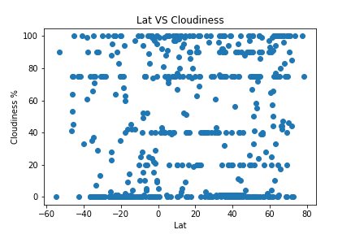
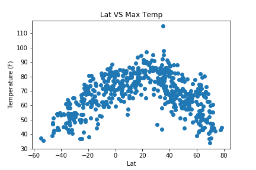

# Latitude-analysis-dashboard
This website consists of 7 pages total, including:

A home page containing:
An explanation of the project.
And links to each visualizations page.

There are four visualization pages, each with:
A visualization for a selected comparison.
And a paragraph describing the plot and its significance.

There is a  "Comparisons" page that:
Contains all of the visualizations on the same page so you can easily visually compare them.

There is a "Data" page that:
Displays a responsive table containing the data used in the visualizations.

The pages are responsive (using media queries in js).
